# Tarea 4. Modelos Probabilisticos de Señales y Sistemas
# Grupo 2
# Estudiante: Rubén Venegas Zúñiga - Carné: B78278
# Profesor: Fabián Abarca Calderón

## Parte 1: 

Con los datos de **bits10k.csv** se crea un esquema de modulación BPSK.
Se muestran a continuacion los primeros 5 bits modulados:

**bits[0:5] = [0 1 0 1 0]**

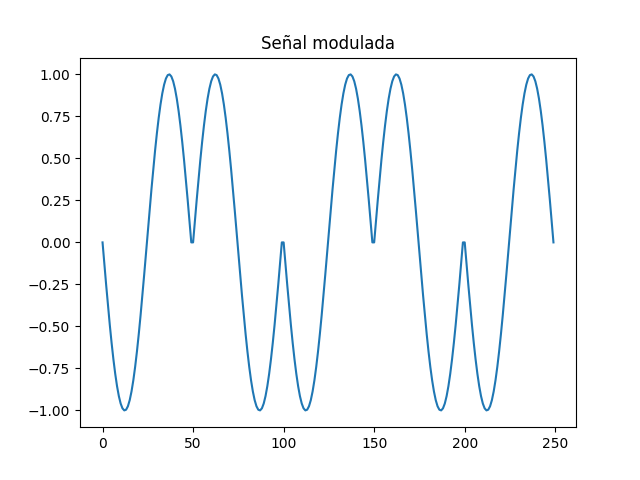

## Parte 2

Se calcula la potencia promedio a partir de la potencia instantánea de la señal, obteniéndose el siguiente resultado:

**Pprom = 0.4900009800019598  W**

## Parte 3

A continuacion se muestran los canales ruidosos del tipo AWGN (ruido aditivo blanco gaussiano) con una relación señal a ruido (SNR) desde -2 hasta 3 dB (se muestran los primeros 5 bits de las señales).

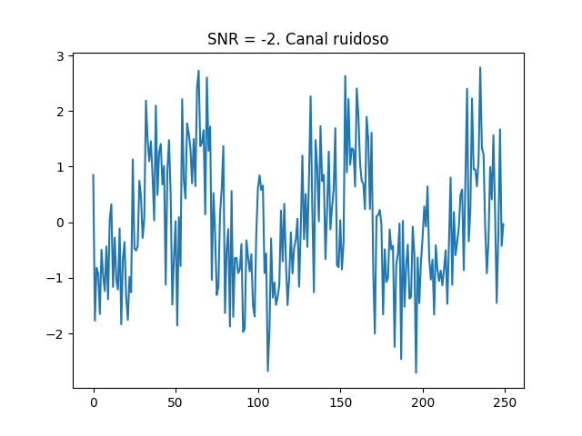

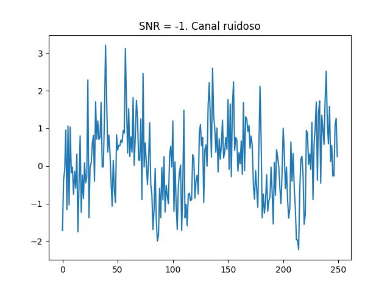

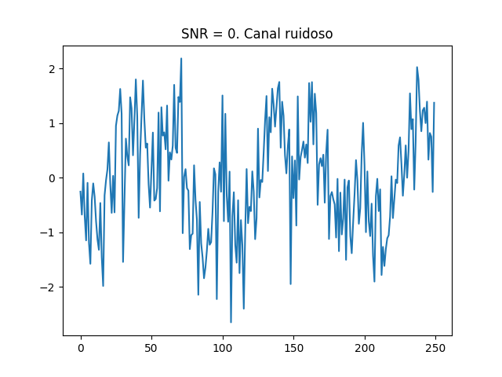

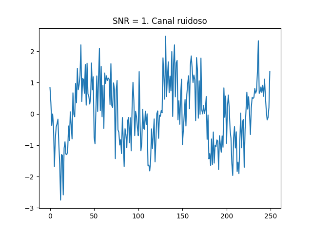

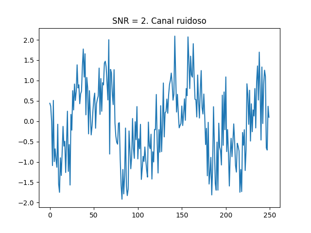

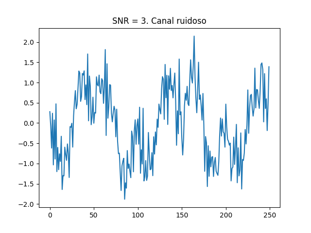

## Parte 4

Se muestran las gráficas obtenidas de la densidad espectral de potencia de la señal con el método de Welch (SciPy), antes y después del canal ruidoso (se muestran los primeros 5 bits de las señales).

Antes del canal ruidoso:

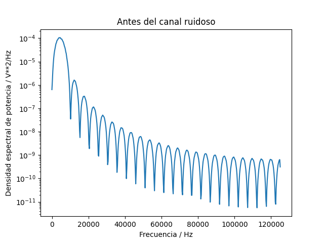

Y después de pasar por el canal ruidoso para cada nivel de SRN:

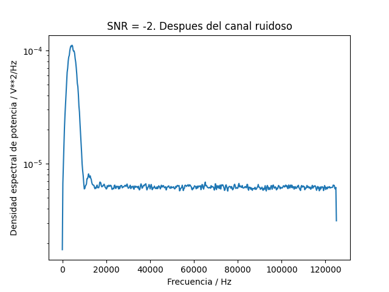

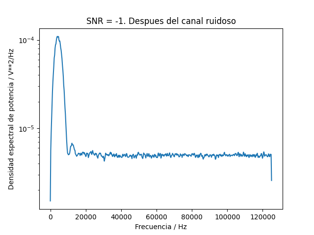

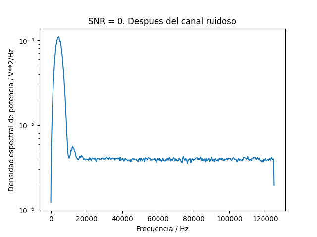

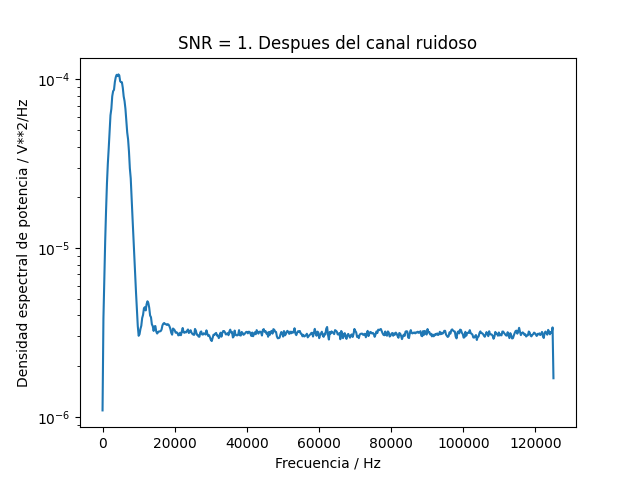

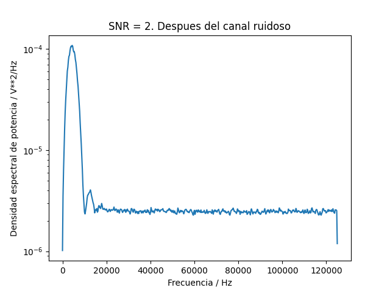

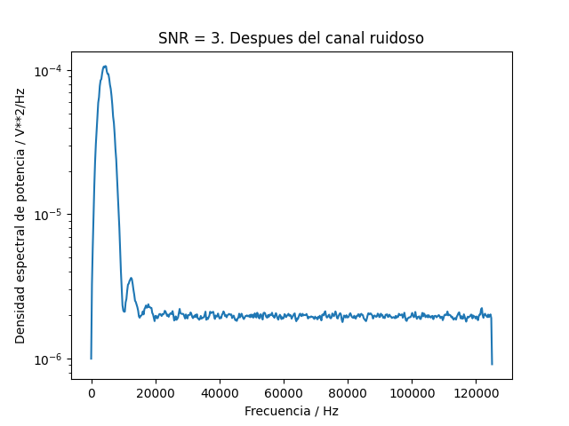

## Parte 5

Se demodulan y decodifican las señales para cada nivel de SNR por medio de detección de energía en cada período de las ondas de la señal y se muestran los errores registrados en cada nivel de SNR:

**Con SNR = -2 hay un total de 0.0 errores en 10000 bits para una tasa de error de 0.0.**

**Con SNR = -1 hay un total de 0.0 errores en 10000 bits para una tasa de error de 0.0.**

**Con SNR = 0 hay un total de 0.0 errores en 10000 bits para una tasa de error de 0.0.**

**Con SNR = 1 hay un total de 0.0 errores en 10000 bits para una tasa de error de 0.0.**

**Con SNR = 2 hay un total de 0.0 errores en 10000 bits para una tasa de error de 0.0.**

**Con SNR = 3 hay un total de 0.0 errores en 10000 bits para una tasa de error de 0.0.**

## Parte 6

Al graficar BER versus SNR se obtiene el siguiente resultado:

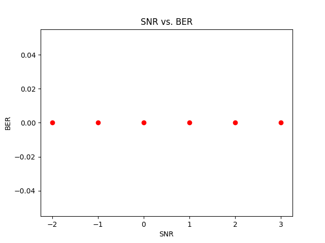

El resultado anterior es el esperado al observar los resultados obtenidos en la parte 5.